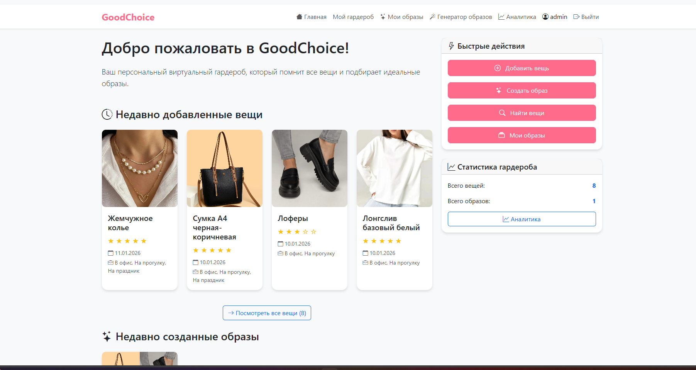
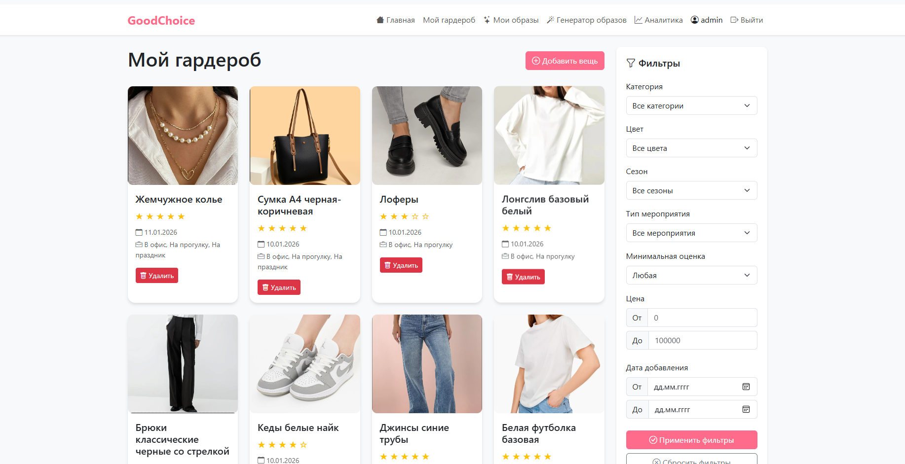
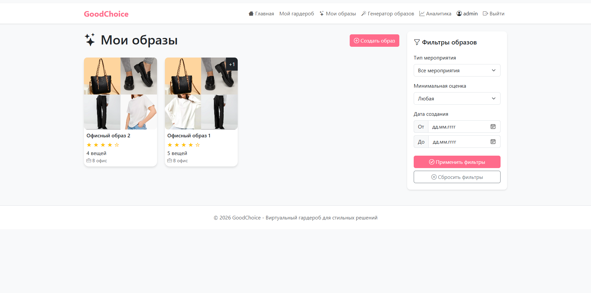
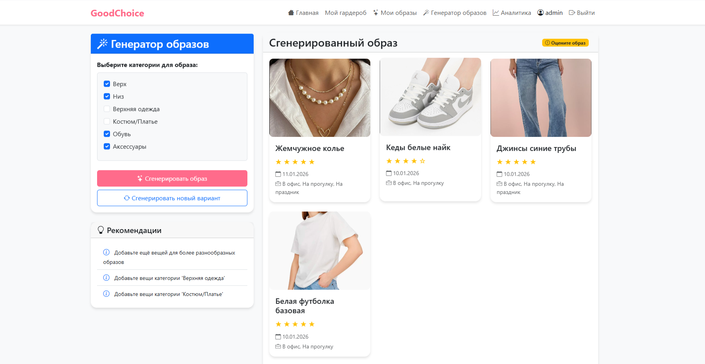
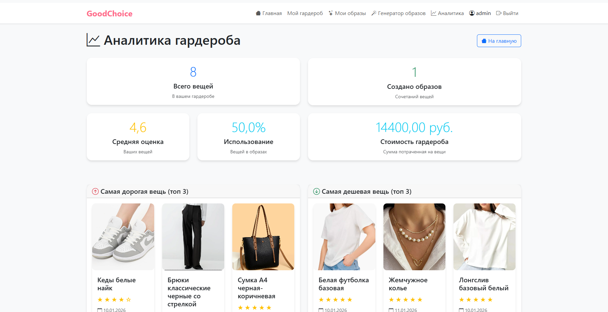

# GoodChoice — Виртуальный гардероб

Веб-приложение для организации персонального гардероба, а также для ручного и интеллектуального подбора образов одежды. 
Система анализирует ваши вещи, изучает вкусы через оценки и генерирует гармоничные сочетания под любой случай.

**Ссылка на рабочий проект:**  
- https://goodchoice.onrender.com


## Технологии

**Backend:**
- Python 3.11.9
- Django 4.2
- SQLite

**Data Science & Analytics:**
- Pandas — анализ и агрегация данных
- Plotly — интерактивная визуализация графиков

**Frontend:**
- Bootstrap 5 — адаптивный интерфейс
- JavaScript (AJAX) — динамические элементы
- Bootstrap Icons — векторные иконки

**Генерация:**
- Собственный алгоритм совместимости вещей
- Обучение с подкреплением на оценках пользователя


## Скриншоты

  
*Главная страница приложения*

  
*Список вещей в гардеробе*

  
*Список образов созданных вручную*

  
*Сгенерированный образ одежды*

  
*Графики и аналитика по данным пользователя*


## Как запустить проект локально

1. **Клонируйте репозиторий:**
```bash
git clone https://github.com/ksu-ha/GoodChoice.git
cd <ваш-репозиторий>
```

2.	**Создайте и активируйте виртуальное окружение:**
```bash
python -m venv venv

source venv/bin/activate  # Linux / Mac
venv\Scripts\activate     # Windows
```

3.	**Установите зависимости:**
```bash
pip install -r requirements.txt
```

4.	**Выполните миграции:**
```bash
python manage.py migrate
```

5.	**Создайте суперпользователя (по желанию):**
```bash
python manage.py createsuperuser
```

6.	**Запустите сервер:**
```bash
python manage.py runserver
```

7.	**Откройте проект в браузере:**
http://127.0.0.1:8000/


Проект выполнен в рамках учебной дисциплины.
Автор: Ксения